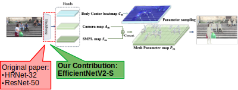
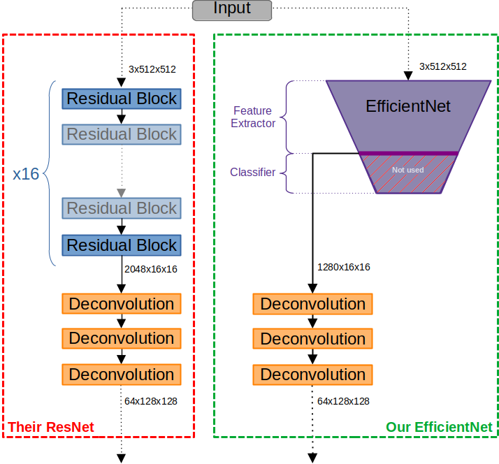
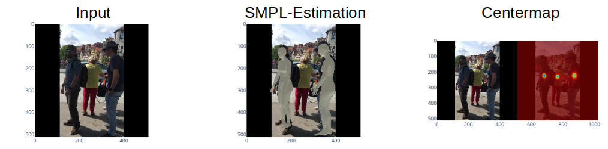

# ROMP - Monocular, One-stage, Regression of Multiple 3D People

ROMP is a one-stage 3D pose estimator of humans. The working principle can be summarized as follows: For each detected human in a scene, the network predicts:
- Parameterized Mesh to describe the joint-angles and limb expansion (in SMPL format)
- Pose of human in current image frame (i.e. how a mesh-rendering has to be scaled, rotated or translated to oberlap the detected human in the scene)

This principle is explained in great detail in their original publication [^1]. In [^2], we give a more compact explanation and we compare ROMP against other state-of-the-art state estimators for our specific AV application. Our project implementation is based on their original GitHub repository [^3]. Their original ReadMe is [here](README_orig.md). This entire project was conducted on following machine configuration:

|Name |Component|
|---|---|
| CPU | AMD Ryzen 7 1800X |
| GPU | NVIDIA GeForce GTX 1060 6GB| 
| RAM | 32 GB | 

## Set-Up

### Codebase
```sh
# Clone Repositoy
git clone https://github.com/vita-student-projects/3d_human_pose_estimation_gr15

# Python Environment
# cd 3d_human_pose_estimation_gr15
conda create -n ROMP python=3.[YOUR PYTHON3 VERSION]
conda activate ROMP  
conda install -n ROMP pytorch==1.10.0 torchvision==0.11.1 cudatoolkit=10.2 -c pytorch  
pip install -r requirements.txt 
```
### Meta-Data
The following guide downloads and unzips the meta-data. For non-Linux users, this can also be done by manually by downloading [model_data.zip](https://drive.google.com/file/d/1dcuNcdrXhUZrSKrfHuZJVK8OZQE7mEka/view?usp=drive_link) and [trained_models.zip](https://drive.google.com/file/d/1E3-sDsQSGHe2fLmmO8oAE7UvSxzJfjtn/view?usp=drive_link) and unzipping the archives in the repository folder.
```sh
# cd 3d_human_pose_estimation_gr15

# Download Trained Models
wget --load-cookies /tmp/cookies.txt "https://docs.google.com/uc?export=download&confirm=$(wget --quiet --save-cookies /tmp/cookies.txt --keep-session-cookies --no-check-certificate 'https://docs.google.com/uc?export=download&id=FILEID' -O- | sed -rn 's/.*confirm=([0-9A-Za-z_]+).*/\1\n/p')&id=1dcuNcdrXhUZrSKrfHuZJVK8OZQE7mEka" -O model_data.zip && rm -rf /tmp/cookies.txt
unzip model_data.zip
rm model_data.zip

# Download Trained Models
wget --load-cookies /tmp/cookies.txt "https://docs.google.com/uc?export=download&confirm=$(wget --quiet --save-cookies /tmp/cookies.txt --keep-session-cookies --no-check-certificate 'https://docs.google.com/uc?export=download&id=FILEID' -O- | sed -rn 's/.*confirm=([0-9A-Za-z_]+).*/\1\n/p')&id=1E3-sDsQSGHe2fLmmO8oAE7UvSxzJfjtn" -O trained_models.zip && rm -rf /tmp/cookies.txt
unzip trained_models.zip
rm trained_models.zip
```


Remarks
- This procedure was tested on Ubuntu 20.04 and 22.04 machines; we experiences unresolvable issues when trying this set-up in Windows
- For training and evaluation, further dataset-downloads are necessary (see below)


## Contribution

As proposed in [^2], our main contribution is the replacement of their backbone with a smaller architecture in order to reduce the computational load of the AV embedded computer. This means that we modify the deeper layers of the network. Our approach is motivated by the fact that the backbones implemented by [^1] carry ~60 times more parameters than the Head (as shown in the table at the end of this section). More recent pose estimators analyzed in [^2] - especially [^4] - experience good performance by using the EfficientNet architecture. Since this structure promises similar performance using less parameters, we use this architecture to reduce the compute load. 



The specific network architecture we chose is the most recent EfficientNetV2-S which is conveniently available in `pytorch`. For the direct implementation, we took their ResNet-50 as a blueprint (bottom figure left). Since the backbone is the feature extractor in the ROMP application, we do not require the classifier layers. We copy their deconvolution layer-structure to generate the same output layers as before. As the EfficientNet's output-shape differs slightly from the ResNet's, we apply slightly different deconvolution shapes in our contribution. This is summarized here:


This implementation cuts the number of parameters in the backbone by 18% and 28% compared to the HRNet-50 and ResNet-50 respectively. We implemented our contribution in order to fit in the original framework such that training, evaluation, and dataset handling can be overtaken directly.

| Component  | # of Parameters  |
|---|---|
| HRNet-32 backbone (in [^1])  | 28,535,552  |
| ResNet-50 backbone (in [^1])  | 32,552,896  |
| EfficientNetV2-S backbone (our contribution)  |  23,496,592 |
| Head  |  568,018 |

Due to the complexity and bugs of their code, we did not implement our second idea of testing an additional loss term.

## Dataset

All relevant datasets as well as the annotations were made available by the authors of [^1] via a [Google-drive folder](https://drive.google.com/drive/folders/1_g4AbXumhufs7YPdTAK3kFMnTQJYs3w3). They also include instructions on the directory structure such that the files can be processed by their code framework [^3] without any problem. See [this page](docs/dataset.md) for the specific procedure. Depending on the dataset location, one must adapt `dataset_rootdir` in the [config.py](romp/lib/config.py).

| Dataset      | Examples Number | Keypoints |
|--------------|-----------------|-----------|
| MuCo         | 677k            | 21        |
| MPII         | 27k             | 16        |
| MPI-INF-3DHP | 627k            | 28        |
| LSP          | 2k              | 14        |
| Human3.6M    | 3.6M            | 32(17)    |
| CrowdPose    | 20k             | 14        |
| COCO         | 47k             | 17        |
| CMU_Panoptic | 1.5M            | 19        |
| AGORA        | 173k            | 66        |
| 3DPW         | 60k             | 17        |
| PoseTrack    | 66k             | 17        |

### Human3.6M (H36M) Dataset:
This dataset provides a comprehensive and realistic dataset for analyzing human movements and poses in controlled conditions. It was collected using a motion capture system with 4 high-resolution cameras and 4D dynamic body markers. It consists of 11 professional actors (5 females and 6 males) performing 17 different activities in a well-controlled indoor environment with consistent lighting conditions and a static background. The dataset uses 32 joint keypoints, with 17 main keypoints defined as follows:
```sh
H36M_JOINTS = {
    'Hip': 0,
    'RHip': 1,
    'RKnee': 2,
    'RFoot': 3,
    'RFootTip': 4,
    'LHip': 6,
    'LKnee': 7,
    'LFoot': 8,
    'Spine': 12,
    'Thorax': 13,
    'Neck/Nose': 14,
    'Head': 15,
    'LShoulder': 17,
    'LElbow': 18,
    'LWrist': 19,
    'RShoulder': 25,
    'RElbow': 26,
    'RWrist': 27
}
```
If downloaded from the official website of Human3.6M, a preprocessing step is required to extract frames from the original videos and save them as individual image files. You can use the following command for preprocessing:
```sh
python ROMP/romp/lib/dataset/preprocess/h36m_extract_frames.py h36m_extract_frames.py path/to/h36m_video_folder path/to/image_save_folder
```
### CMU Panoptic Studio Dataset:
This dataset provides a comprehensive and diverse set of annotations for human pose and tracking in complex real-world scenarios. It consists of video sequences captured from multiple camera views in various environments, including indoor and outdoor settings. For each frame in the dataset, it provides pixel-level 2D joint annotations for multiple individuals.
```sh
CMU_JOINTS = {
    'Neck': 0,
    'Nose': 1,
    'Pelvis': 2,
    'LShoulder': 3,
    'LElbow': 4,
    'LWrist': 5,
    'LHip': 6,
    'LKnee': 7,
    'LAnkle': 8,
    'RShoulder': 9,
    'RElbow': 10,
    'RWrist': 11,
    'RHip': 12,
    'RKnee': 13,
    'RAnkle': 14,
    'LEye': 15,
    'LEar': 16,
    'REye': 17,
    'REar': 18
}
```
### 3DPW
This dataset is designed to capture the complexity and diversity of human activities in challenging real-world environments. It includes videos of people performing various activities in outdoor settings, such as walking, sitting, running, and more. The videos are recorded with multiple synchronized cameras from different viewpoints to capture the 3D pose and shape of the individuals. It provides detailed annotations for each frame, including 3D joint locations, 2D joint locations, 3D body mesh, camera parameters, and more.
```sh
3DPW_JOINTS = {
    'Pelvis': 0,
    'LHip': 1,
    'RHip': 2,
    'Spine': 3,
    'LKnee': 4,
    'RKnee': 5,
    'Thorax': 6,
    'LAnkle': 7,
    'RAnkle': 8,
    'Thorax_up': 9,
    'LToe': 10,
    'RToe': 11,
    'Neck': 12,
    'LCollar': 13,
    'RCollar': 14,
    'Jaw': 15,
    'LShoulder': 16,
    'RShoulder': 17,
    'LElbow': 18,
    'RElbow': 19,
    'LWrist': 20,
    'RWrist': 21,
    'LHand': 22,
    'RHand': 23
}
```
## Experimental Setup
The training mode of 

One epoch on our system took about 3 hours.
## Results
To verify our findings, we test our implementation against well-established test datasets. For quantitative results, we use following metrics (explained in detail in [^2]):
- PCK X: Percentage of correctly estimated joint positions (X: distance threshold for "correct"/"incorrect" classification)
- MPJPE: Mean Per Joint Position Error
- PA-MPJPE: MPJPE after the skeleton has been Procrustes-aligned with the ground truth
Furthermore, we record the evaluation time in s to process the respective test-set. For the ResNet and HRNet, we give *our* results below that we obtained with their evaluation script and not the values found in their paper. 

### 3DPW VIBE
*Batch-Size: 32*
| Backbone | Version | PCK 0.6 [%] | MPJPE [mm]  | PA-MPJPE [mm] |  Runtime [s] |
|---|---|---|---|---|---|
| Their ResNet-50 | no fine-tune | 0.85  |  142.354 | 71.766  | 809.16  |
| Their ResNet-50 | with fine-tune  | 0.994  | 80.48  |  49.362 |  866.49 |
| Their HRNet-32 | no fine-tune  |  0.955 |  87.856 |  53.001 | 1155.1  |
| Their HRNet-32 | fine-tune  | 0.996  | 77.724  |  46.916 |  1139.78 |
|  **Our EfficientNet** | training protocol A |   0.890  | 135.744  |  80.520 | 957.85  |
|  **Our EfficientNet** | training protocol B |   0.955  |  135.043 | 79.237  | 931.44  |


An exemplary processing of an input sample is visualized here:

### CMU Panoptic
*Batch-Size: 8*

The dataset is split up into group-activities. The activities evaluated here are called "haggling", "mafia", "ultimatum" and "pizza". Find out more on [their project page](http://domedb.perception.cs.cmu.edu/dataset.html).
| Backbone | Version | Haggling-MPJPE [mm] | Mafia-MPJPE [mm]  | Ultimatum-MPJPE [mm] | Pizza-MPJPE [mm] |  Mean MPJPE [mm] |Runtime [s] |
|---|---|---|---|---|---|---|---|
| Their ResNet-50 | no fine-tune | 129.33 |  152.18 | 152.94  | 169.15  |150.90 | 303.43 |
| Their ResNet-50 | with fine-tune  | 108.41  | 123.14 |  140.21 |  145.65 | 129.35 | 327.9 |
| Their HRNet-32 | no fine-tune  |  116.19 |  129.87 |  149.64 | 148.98  | 136.17 | 476.2 |
| Their HRNet-32 | fine-tune  | 116.02  | 131.39  |  144.91 |  146.86 | 134.79 | 475.02 |
|  **Our EfficientNet** | training protocol A | 141.18  | 167.73  |  163.12 | 175.56  | 161.90 | 357.21 |
|  **Our EfficientNet** | training protocol B |   159.47 | 170.07 | 172.15 | 186.19 | 171.97 | 365.65 | 

### Webcam Demo and Symmetry Issue

We observed during real-time inference from webcam, that the skeleton output is very symmetric when using the EfficientNet backbone with both train protocols. By this, we mean that the left and right arms or legs  have always very similar joint angles even when those limbs are very asymmetric on the real human. We assume that these angles are a mean of the two different joint angles on the real human. However, we find the pose estimation in case of symmetric human motion very good considering our incomplete training process. Even more complicated postures like crouching are detected properly. Below, we show a real life performance of our EfficientNet in comparison to their ResNet-backbone.


# Resources
[^1]: Sun, Y., Bao, Q., Liu, W., Fu, Y., Black, M. J., & Mei, T. (2020). Monocular, One-stage, Regression of Multiple 3D People. arXiv preprint arXiv:2008.12272.
[^2]: Milestone 1 Report: https://drive.google.com/file/d/15AhJr35AdtqHdkhOHylhIPvTnorl-QHf/view?usp=drive_link
[^3]: Original GitHub Repository https://github.com/Arthur151/ROMP
[^4]: Sárándi, I., Hermans, A., & Leibe, B. (2022). Learning 3D human pose estimation from dozens of datasets using a geometry-aware autoencoder to bridge between skeleton formats. arXiv preprint arXiv:2212.14474.
